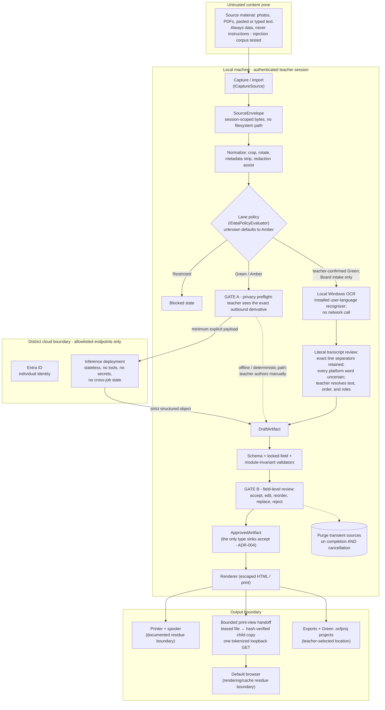
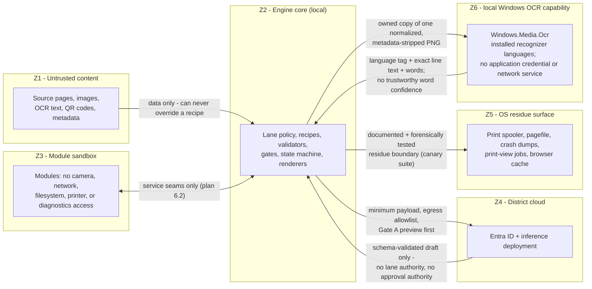

# Data-flow and trust boundaries

**Date:** 29 August 2026 · **Last revised:** 30 August 2026 · Companion to implementation plan §4 (lanes), §5 (gates), §6 (architecture), §7 (controls). These diagrams are the Days 1–15 deliverable; they are revised whenever a flow or boundary changes (Gate 5 change control).

## The artifact data-flow, gates inline

Every artifact walks the mandatory state machine (plan §6.3). The three human gates and the purge are structural, not procedural.

**Gate C** (direct-source adult safety review) is orthogonal to this flow: on an apparent safety concern the program pauses normal output and privately directs the supervising adult to the original source and the district procedure. It broadcasts nothing.

## Trust zones and what may cross each boundary

## Boundary register

| Boundary | Crosses it | Never crosses it | Verification |
|---|---|---|---|
| Z1 → Z2 | Source bytes as data | Instructions, tool calls, lane decisions | Prompt-injection red-team corpus |
| Z3 ↔ Z2 | Seam calls (`IRecipeRunner`, `IRenderer`, …) | Direct device/network/file access | Architecture tests (tests/Unit) fail the build on a forbidden reference |
| Z2 → Z4 | Gate-A-previewed minimum payload to the exact allowlisted HTTPS origin, through a provider-owned transport with redirects disabled | Amber content without preview; anything without explicit Generate; redirects or replay to another origin | Egress trace; no-background-calls and no-redirect tests |
| Z4 → Z2 | Strict structured object | Free-form output, tool use, cross-job state | Provider capability tests; fake-provider suite |
| Z2 ↔ Z6 | An owned in-memory copy of one normalized, metadata-stripped PNG crosses to the local Windows OCR capability; exact line text, its word list, and the installed recognizer's language tag return. The service aligns words ordinally to the line and retains exact leading/inter-word/trailing text, so `x=2`, `25 mL`, punctuation, and arrows do not become invented spaces; candidate and verified views use the same projection | A filesystem path, credential, remote request, lane or role decision, approval, or trustworthy word-confidence claim. `Windows.Media.Ocr.OcrWord` exposes no confidence, so every returned word remains uncertain until the teacher acts. Any line/word mismatch fails closed to the manual transcript path | [WindowsOcrServiceTests](../../tests/Integration/WindowsOcrServiceTests.cs); [TranscriptSessionTests](../../tests/Unit/TranscriptSessionTests.cs) |
| Z2 → Z5 | Unavoidable OS artifacts within documented limits. Print view crosses only after approval through an immutable leased job, a hash-verified child copy, and one exact tokenized loopback response write; the parent accepts only child exit 0 within its bound. | An unapproved artifact; a mutable or reused print-view pathname; content in logs. Browser receipt/render, cache erasure, pagefile erasure, and spool erasure are not claimed. | [PrintViewPathTests](../../tests/UiAutomation/PrintViewPathTests.cs); synthetic canary search after success, failure, crash, reboot, print, uninstall |
| Z2 → storage | ProgramData = IT policy (read); LocalAppData = preferences + content-free diagnostics; teacher-selected = Green projects only | Secrets or projects beside the executable; Amber autosave | Storage-location tests; residue suite |

## Standing honesty rule

"The application does not intentionally persist the source capture" is the claim these diagrams support. Approved print views do use one bounded temporary job and a copy-owning loopback helper before immediate cleanup is attempted. Pagefiles, crash dumps, filesystem remanence, browser caches, spoolers, camera drivers, and endpoint tools remain the OS residue surface — bounded and tested where named, never denied (plan §6.4).
