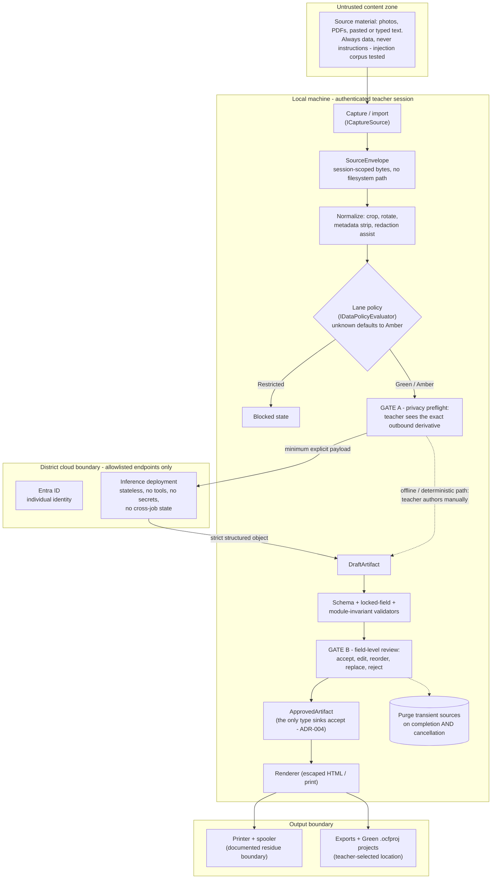
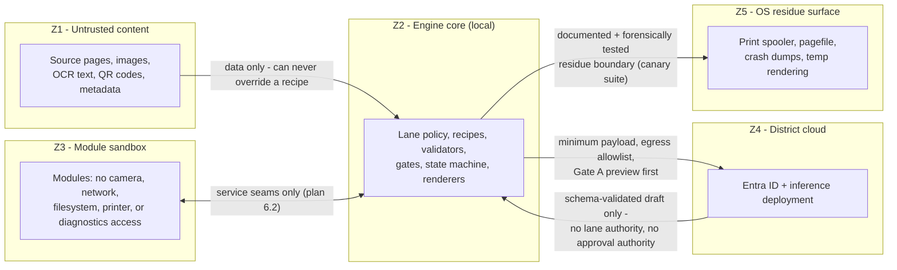

# Data-flow and trust boundaries

**Date:** 29 August 2026 · Companion to implementation plan §4 (lanes), §5 (gates), §6 (architecture), §7 (controls). These diagrams are the Days 1–15 deliverable; they are revised whenever a flow or boundary changes (Gate 5 change control).

## The artifact data-flow, gates inline

Every artifact walks the mandatory state machine (plan §6.3). The three human gates and the purge are structural, not procedural.

**Gate C** (direct-source adult safety review) is orthogonal to this flow: on an apparent safety concern the program pauses normal output and privately directs the supervising adult to the original source and the district procedure. It broadcasts nothing.

## Trust zones and what may cross each boundary

## Boundary register

| Boundary | Crosses it | Never crosses it | Verification |
|---|---|---|---|
| Z1 → Z2 | Source bytes as data | Instructions, tool calls, lane decisions | Prompt-injection red-team corpus |
| Z3 ↔ Z2 | Seam calls (`IRecipeRunner`, `IRenderer`, …) | Direct device/network/file access | Architecture tests (tests/Unit) fail the build on a forbidden reference |
| Z2 → Z4 | Gate-A-previewed minimum payload to allowlisted endpoints | Amber content without preview; anything without explicit Generate | Egress trace; no-background-calls test |
| Z4 → Z2 | Strict structured object | Free-form output, tool use, cross-job state | Provider capability tests; fake-provider suite |
| Z2 → Z5 | Unavoidable OS artifacts within documented limits | Intentional persistence of Amber content; content in logs | Synthetic canary search after success, failure, crash, reboot, print, uninstall |
| Z2 → storage | ProgramData = IT policy (read); LocalAppData = preferences + content-free diagnostics; teacher-selected = Green projects only | Secrets or projects beside the executable; Amber autosave | Storage-location tests; residue suite |

## Standing honesty rule

"The application does not intentionally persist the source capture" is the claim these diagrams support. Pagefiles, crash dumps, spoolers, camera drivers, and endpoint tools are the OS residue surface — bounded and tested, never denied (plan §6.4).
